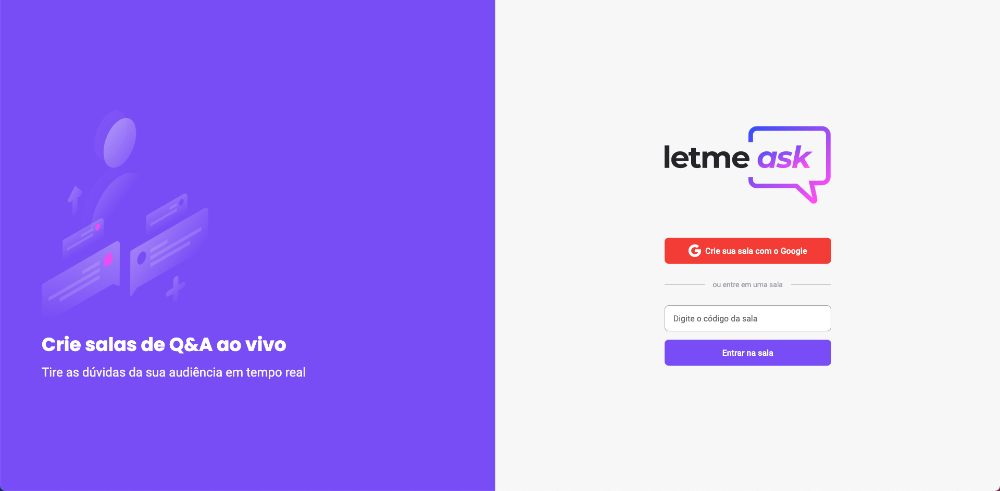

<h1 align="center">
    
</h1>

<br>

## ✏️ Projeto

Uma aplicação para perguntas e respostas (Q&A), em que um usuário pode criar salas e outras pessoas podem interagir ao vivo, criando perguntas e dando likes!    
    
Este é um projeto que desenvolvido durante o Next Level Week da [Rocketseat](https://rocketseat.com.br/).

## 🔧 Ferramentas

- [React](https://reactjs.org)
- [TypeScript](https://www.typescriptlang.org/)
- [Firebase](https://firebase.google.com/)
- [Sass](https://sass-lang.com/)

## ✅ Requisitos

- Instalar [Node.js](https://nodejs.org/en/download/) e [Yarn](https://yarnpkg.com/).

Clone o projeto e acesse a pasta:  
```bash
$ git clone https://github.com/igorkf/letmeask.git
$ cd letmeask
```

Instale dependências e comece a aplicação:
```bash
# install dependencies
$ yarn

# start
$ yarn start
```
Acesse o aplicativo `http://localhost:3000`

## 🖥️ Layout

O layout do projeto está no [Figma](http://figma.com/):

- [Protótipo por Rebecca Gonzalez](https://www.figma.com/file/rgNLDQE5dlwJriJTB8tn11/Letmeask) 

## 📝 License

This project is licensed under the MIT License. See the [LICENSE](LICENSE) file for details.
